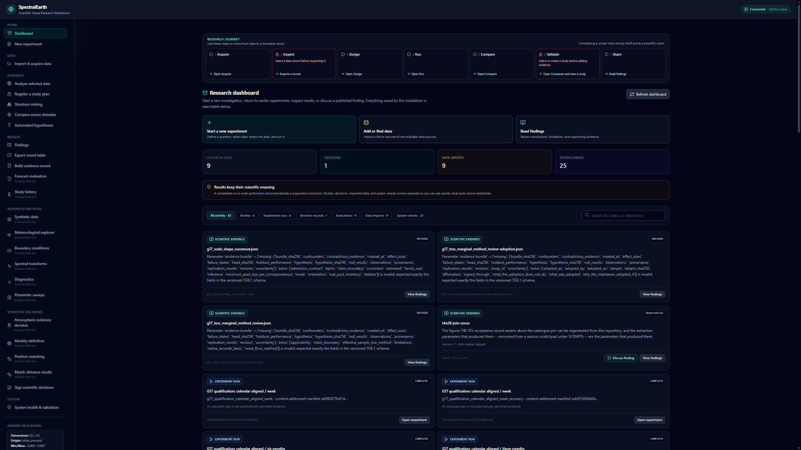
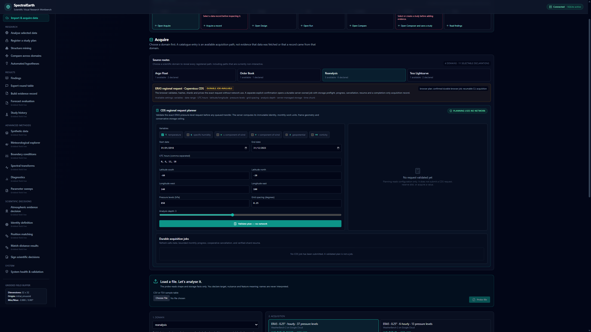
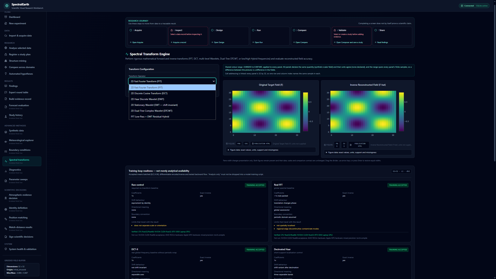
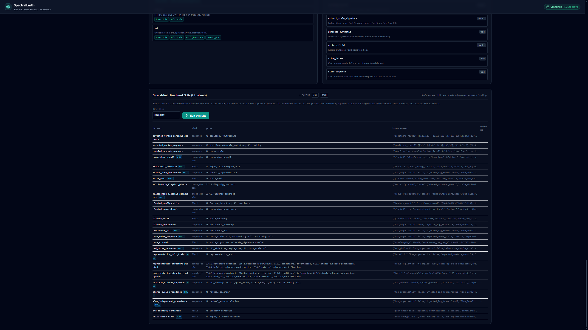

# SpectralEarth Research Workbench


SpectralEarth is a local-first scientific workbench for multiscale analysis, controlled
experiments, cross-domain structural discovery, evidence management, and research review. It
combines a PyTorch/xarray/FastAPI backend with a React/Vite/Plotly dashboard, durable
content-addressed records, and a Jupyter playground.

It is a research instrument, not an automatic claim generator. A completed computation is kept
separate from a finding, a review is kept separate from evidence, and unavailable or invalid
measurements are reported as refusals rather than silently omitted.

## Start the application

On Windows, from the repository root:

```powershell
.\start_platform.ps1
```

Or double-click `start_platform.bat`. On first use, allow the launcher to install dependencies.
The dashboard opens at [http://localhost:3000](http://localhost:3000); the FastAPI service runs at
[http://127.0.0.1:8000](http://127.0.0.1:8000).

Manual startup is described under [Installation and operation](#installation-and-operation).

## Documentation map

This README is an orientation and operating guide. It is **not the status of record**.

| Document | Authority |
|---|---|
| [`architecture.md`](architecture.md) | What is implemented now, every HTTP route, architectural boundaries, test inventory, and the defect ledger. Section 0 is the status authority. |
| [`PLAN.md`](PLAN.md) | What should happen next. It deliberately does not duplicate implementation status. |
| [`roadmap.md`](roadmap.md) | Atmospheric programme history, decisions, and rules R1–R16. |
| [`roadmap_cross_domain.md`](roadmap_cross_domain.md) | Cross-domain programme history and rules R17 onward. |
| [`VERIFICATION.md`](VERIFICATION.md) | Captured command output and measured evidence behind documented figures. |

The documentation audit checks module coverage, API-route coverage, test inventory counts, defect
status, and cross-document suite totals.

## **Current frontier — 2026-09-14**

This is a short orientation only; [`architecture.md`](architecture.md) section 0 supersedes it.

- The shared application, dashboard, experiment composer, durable runner, evidence ladder,
  review workflows, scientific visualizations, registries, and validation surfaces are implemented.
- The atmospheric Phase 4C gate has run on an acquired 8,764-frame ERA5 record and returned its
  declared PASS. A separate atmospheric identity programme still has no approved identity
  criterion or mining radius; its latest candidate is drafted but not adopted.
- The G17 cross-domain release remains withheld by its scientific qualification conditions. G18's
  interface programme and G19's private conversation with the record are complete. A discussion
  can select relevant complete studies across the corpus, re-ground every turn, enforce its own
  provider/cost budget, and prove that deleting the transcript changes no touched claim.
- The regional and external-ensemble forecasting contracts, representations, dataset builders,
  artifact verification, persistence comparison, and receipt viewer exist. No laboratory model or
  FCN3 forecast has been integrated and no learned forecast-skill claim has been established.
- Open defects: **D84, D85, D96, D97, D98, D99, D100**. D18 is separately tracked as partial.
- Last measured full backend run: **5038 passed**, 1 xfailed, 7 failed, and 4 skipped. The failures
  and the one non-reproduced Windows filesystem race are classified in `architecture.md`; this is
  not a claim that every scientific acceptance gate passes.

**What has not been done**

- No identity criterion or mining radius is approved for the acquired atmospheric record.
- The full physical mining/adjudication gate has not been run on that record, so representation
  scoring remains gated.
- G17 has not earned a release verdict.
- No production learned weather model, FCN3 worker, real forecast artifact, or controlled
  representation-versus-forecast experiment has run through the platform.
- ROCm and Apple MPS parity are not measured; broad CPU/CUDA parity applies only where
  `architecture.md` explicitly records it.
- GRIB upload, automatic regridding, nearest-time substitution, and silent unit conversion are not
  supported.

## Key Scientific Pillars

### 1. Data acquisition, import, and semantic inspection

SpectralEarth supports several data shapes without pretending they are interchangeable:

| Shape | Implemented sources and inputs | Important boundary |
|---|---|---|
| Regular grids | Local NetCDF, zipped Zarr, simulated meteorological fields, WeatherBench-style public ERA5 Zarr stores, Copernicus CDS regional ERA5, and the registered GLORYS12V1 ocean store | Network access is opt-in. Coordinates, variables, levels, cadence, source identity, and crop geometry remain explicit. |
| Irregular profiles | Argo GDAC profile discovery/acquisition and declared profile reductions | Non-stationary support and irregular sampling are preserved or explicitly reduced; profiles are not silently treated as grids. |
| Light curves | TESS/SPOC products through MAST/AWS | Exact TIC/sector/product identity, quality policy, checksums, time reference, and bounded product counts are recorded. |
| Channel tables | UTF-8 CSV/TSV/text with a researcher-selected clock and named value channels | Column meaning is never inferred into a scientific declaration. Domain violations and admissible operations are shown before analysis. |
| General uploaded fields | `.nc`, `.nc4`, `.netcdf`, `.cdf`, `.zarr.zip`, `.csv`, and `.json`, up to 256 MiB | Inspection precedes reading. Axis roles may be declared explicitly; filename and coordinate hints are recorded as hints, not facts. |
| Independent sample tables | CSV/TSV probe, declaration, capability profile, and content-bound planner handoff | Sample roles, units, grouping, ordering, nuisance variables, and relationships must be declared by the researcher. |

The source and store registries resolve available routes without hard-wiring a dataset into the
engine. Cached data remains usable offline. Local file changes invalidate cached metadata rather
than requiring an API restart.

The platform does not silently download data, substitute simulated values for a missing real
source, infer a domain from a filename, interpolate mismatched clocks, regrid mismatched spatial
coordinates, or convert unknown units.



### 2. Physical data model and geometry

- `PhysicalField` binds tensor values to coordinate metadata, units, grid identity, and device.
- `FieldSequence` adds an explicit time axis, cadence, observation coverage, and temporal slicing.
- Axis-role resolution distinguishes time, spatial, level, category, member, and other roles,
  including multiple axes with the same role.
- Grid utilities provide latitude/longitude metric distances, area weighting, regularity checks,
  interior masks, and support-aware cropping.
- Temporal splits enforce train/validation/test separation and embargoes before histories or
  targets are constructed.
- Large arrays travel through a content-addressed artifact store; lineage carries references and
  summaries instead of embedding repeated arrays in JSON.

### 3. Spectral and multiscale transforms

| Transform | Capability |
|---|---|
| FFT | Invertible 2-D real FFT with magnitude/phase views and explicit real/imaginary packing in the training module. |
| DCT | DCT-II analysis with DCT-III inverse and cached differentiable matrices. |
| DWT | Multilevel decimated Haar transform in the general registry; training-native Haar and db2 periodised representations. |
| SWT | Undecimated Haar/db2/db3 stationary wavelets, periodic or reflective boundaries, exact inverse, support geometry, and parent-grid coefficients. |
| DTCWT | Real Kingsbury q-shift dual-tree complex wavelet transform with six orientations, exact packing conventions, inverse, autograd, and measured CPU/CUDA acceptance. |
| Hybrid | FFT low-pass plus wavelet analysis of the high-frequency residual. |
| Raw | Identity representation for controlled training comparisons. |

`CoefficientField` preserves time, scale, orientation, native-grid shape, validity masks, and
source identity. `WaveletBank` enumerates declared families, levels, orientations, and pressure
levels as an ordinary experiment matrix. Support calculations flow into acquisition planning and
valid-interior visualization.



### 4. Synthetic fields, perturbations, and boundary analysis

- Synthetic sinusoid, vortex, front, turbulence, noise, and benchmark sequence generators.
- Reproducible rotation, translation, and noise perturbations.
- Periodic, zero, reflective, and replicate boundary treatments.
- Tukey, Hann, and Hamming tapering where the selected workflow supports them.
- Boundary-gradient, discontinuity, spectral-leakage, reconstruction, and perturbation metrics.
- Known-answer fixtures for null, planted, shifted, multiscale, cross-domain, and failure cases.

Synthetic success validates apparatus behavior; it is not evidence about a real domain.

### 5. Diagnostics and statistical controls

- Radial power spectral density and power-law slope fitting with fit uncertainty.
- Area-weighted RMSE, MAE, bias, correlation, spectral error, wavelet energy, scale-resolved
  errors, boundary-distance errors, and lead-time decomposition.
- Mutual information, lagged mutual information, and transfer entropy.
- Train/test replication gates, complete-family multiple-testing correction, effect sizes,
  corrected q-values, surrogate resolution checks, and power/refusal reporting.
- Circular-shift, phase-based, and other domain-legitimate surrogate nulls that preserve declared
  nuisance structure.
- Stationarity checks, Bartlett effective sample sizes, naive-versus-corrected correlation
  significance, and explicit refusal of unsafe Fourier-surrogate interpretations.
- Spatial effective-sample and correlation-length analysis, crop adequacy, and power curves.
- Automated screening of completed parameter sweeps for numerical correlations and categorical
  ANOVA effects, corrected over the complete family, with auditable follow-up configurations.
- Three-valued decisions where missing or insufficient information remains `INCONCLUSIVE`,
  `INVALID`, `REFUSED`, or `NOT_MEASURED` instead of becoming false or zero.

A bare confidence percentage is not renderable. Association views keep support, confidence, base
rate, lift, interval, and surrogate-corrected lift together.

### 6. Multiscale structure discovery

The atmospheric structure pipeline can:

1. derive per-time/per-scale energy, participation ratio, Gini concentration, and threshold counts;
2. test lagged cross-scale dependencies against a declared surrogate family;
3. locate spectral maxima inside valid interiors and track them through time;
4. represent simultaneous features as attributed graphs and compute invariant signatures;
5. calibrate, cluster, and mine recurring constellations under bounded workloads;
6. build timed event records, count sequences and repeated gaps, and test precursor rules;
7. query results in both directions without narrowing the already-paid test family;
8. project support-aware evidence footprints back onto the source grid;
9. test cross-region transfer and propose experiments that state what would retract a result; and
10. compare structures with signed external references under an explicit physical gate.

The stages are implemented, but the acquired-record programme has not earned the identity
criterion and radius required for the full physical gate.

### 7. Domain declarations and cross-domain analysis

Domains enter through one onboarding contract: axis semantics, geometry or its explicit absence,
licence, known assumption violations, lag policy, wording glossary, adapter, and conformance
fixtures. Built-in and extension domains use the same path.

Current adapters cover atmospheric reanalysis, Argo floats, TESS light curves, and local
order-book records. The generic Composer renders controls from adapter schemas.

Cross-domain capabilities include:

- exact-clock alignment with retained and discarded observations reported;
- refusal of interpolation and invented cadence;
- physical lag families expressed in seconds and checked against each domain's floor;
- versioned manifests binding sources, adapters, transforms, relationships, nulls, correction,
  budgets, and output semantics;
- canonical structural trajectories that preserve coverage and missingness;
- family accounting without treating domains as exchangeable replicates;
- scale/shape calibration and qualification fixtures;
- curated real-record pool readiness, review, adoption, and immutable profiles; and
- comparison views that refuse shared axes or colour scales when semantics do not permit them.

The G17 release verdict remains `NOT_RELEASEABLE`; the dashboard exposes the blocking evidence and
human review controls rather than converting readiness into approval.

### 8. Object-first tabular structure analysis

For independent sample tables, implemented methods include:

- pairwise representation redundancy, complementarity, synergy/XOR, and null checks;
- conditional-information tests with declared nuisance variables and overlap/support admission;
- stable-subspace generation using span/projector invariance;
- unchanged held-out stable-subspace confirmation; and
- external-target certification with no adaptation after the target is opened.

Every plan binds exact file bytes and declarations. Changed inputs, leakage-prone splits,
inadequate permutation resolution, and unsupported geometry refuse by name.

### 9. Experiment composition and durable execution

The Composer supports domain/source selection; declared clocks, windows, relationships, alignment,
transforms, statistics, nulls, correction, coverage, budgets, and outputs; generated structural
contracts; known-answer qualification; immutable manifest revisions; preflight; run/resume;
comparison; interpretation; receipt export; and editable successors.

The durable journal supports serial, thread, and process executors, deterministic seeds,
component-level result addresses, process-loss resume, timeouts, failed-component retry, and
cancellation between components. Completed paid or expensive work is retained. Changing a frozen
plan creates a new identity.

### 10. Provenance, preregistration, evidence, and claims

- SQLAlchemy/SQLite stores experiment metadata and lineage; migrations run at startup.
- Artifacts and portable receipts use canonical JSON and SHA-256 identities.
- Preregistration seals the complete test family and prevents held-out reuse.
- Evidence bundles are immutable append-only chains with ten typed evidence categories.
- The claim ladder derives the permitted rung; clients cannot submit or promote one.
- Findings return claimable, not claimable, contradictory evidence, alternatives, and next
  observation together.
- Domain translation changes wording, not facts, and keeps every licence/bound attached.
- Human declaration/adoption requires a name and explicit affirmation.
- Portable receipts preserve manifest, run, source, adapter, environment, result/refusal,
  evidence absences, and reconstruction checks.

### 11. Findings, formal review, and private discussion

- **Findings** reads a published bundle in a selected vocabulary with limitations, contradictory
  evidence, alternatives, exact figures, provenance, and the untranslated record.
- **Expert round table** is a formal recorded eight-seat adversarial review. It requires a
  server-side Gemini key and explicit paid-call authorization. Calls, dissent, concessions,
  outcomes, token usage, and partial paid work bind to the exact bundle revision.
- **Discuss this finding** is a multi-turn interpretation aid. Every turn reloads the complete
  current evidence bundle, finding, matching runs, and formal review, and refuses stale identity.
  It remains in browser memory unless the researcher separately confirms **Save discussion**.

Neither review path can alter evidence or move the claim ladder. Saved discussion is labelled
interpretation, never evidence.

### 12. Forecasting and representation-evaluation seams

The implemented foundation includes leakage-safe regional forecast datasets over aligned
`t/q/u/v/z` fields; calendar/ratio splits and embargoes; train-only normalization; lazy bounded
Zarr preparation; differentiable representations; persistence and existing-model adapters;
model/config/checkpoint hashes; held-out error and persistence-skill evaluation; FCN3 request and
result contracts; strict cube authentication; exact matched ERA5 truth; ensemble CRPS,
spread/skill, rank diagnostics; portable evaluation jobs; and receipt import in the Forecast
Evaluation workspace.

These are integration contracts, not evidence of learned skill. FCN3, its worker/checkpoint, a
real external forecast artifact, and the motivating laboratory model have not been supplied.

### 13. Visualization, export, and accessibility

- Heatmaps, line charts, comparisons, lineage graphs, scale/orientation views, and exact-value
  tables carry missingness, units, provenance, and validity metadata.
- Figure values are keyboard-addressable without relying on hover or colour.
- Valid-interior and uncertainty overlays include text equivalents and refuse invalid geometry.
- Linked panes resize by pointer or keyboard and collapse to document order on narrow screens.
- Publication export preserves rendered figures, exact values, metadata, and claim boundaries.
- The shell supports keyboard navigation, focus restoration, reduced motion, responsive reflow,
  non-colour status, and screen-reader workspace headings.

This is accessibility evidence, not formal WCAG certification.

### 14. Validation and extension architecture

Known-answer registries cover fields, sequences, cross-domain cases, representation structure,
alignment, calibration, identity, and null safeguards. System health exposes devices, executors,
database revision, registries, benchmarks, qualification gates, and evidence state.

Registry extension points include data sources/stores, atomic domain onboarding, domain adapters,
transforms, training representations, experiment actions, alignment kernels, null families,
statistics, comparison views, receipt fields, benchmark fixtures, and capability routes. Bundled
`extensions/` modules demonstrate Argo, TESS, and standardized record adapters.



## Dashboard workflow

| Area | Workspaces |
|---|---|
| Home | Dashboard; New experiment |
| Data | Import & acquire data |
| Research | Analyse selected data; Register a study plan; Structure mining; Compare across domains; Automated hypotheses |
| Results | Findings; Expert round table; Build evidence record; Forecast evaluation; Study history |
| Advanced methods | Synthetic data; Meteorological explorer; Boundary conditions; Spectral transforms; Diagnostics; Parameter sweeps |
| Scientific decisions | Atmospheric evidence decision; Identity definition; Position matching; Match-distance results; Sign scientific decisions |
| System | System health & validation |

The global journey is Acquire → Inspect → Design → Run → Compare → Validate → Share. It is
navigation, not a second scientific state machine.

## Installation and operation

### Prerequisites

- Python 3.9 or newer; Python 3.11+ is recommended.
- Node.js LTS and npm.
- Optional NVIDIA CUDA. CPU operation remains supported.

### Automatic Windows setup

```powershell
.\start_platform.ps1
```

The launcher can create/update `.venv`, install dependencies, run migrations, and start both
services. `start_platform.bat` is the double-click entry point.

### Manual setup

```powershell
py -m venv .venv
.\.venv\Scripts\Activate.ps1
python -m pip install -r requirements.txt
python -m uvicorn src.api.main:app --host 127.0.0.1 --port 8000 --reload
```

In another terminal:

```powershell
cd frontend
npm install
npm run dev
```

Optional integrations:

```powershell
python -m pip install -r requirements-cds.txt
python -m pip install -r requirements-ocean.txt
python -m pip install -r requirements-astronomy.txt
```

These do not authorize network access.

### Local configuration

The backend loads repository-root `.env.local` before adapter registration. Process variables
win. Set `SPECTRALEARTH_LOAD_LOCAL_ENV=0` to disable local-file loading.

| Variable | Purpose |
|---|---|
| `SPECTRALEARTH_ALLOW_NETWORK=1` | Enables routes that separately require network consent. |
| `GEMINI_API_KEY` or `GOOGLE_API_KEY` | Server-side model key for review and finding discussion. |
| `SPECTRAL_STUDY_ROOT` | Published evidence-bundle directory. |
| `SPECTRAL_REVIEW_ROOT` | Formal review artifact directory. |
| `SPECTRAL_CONVERSATION_ROOT` | Explicitly saved discussions; unsaved chats never use it. |
| `EXPERIMENT_RUN_DIR` | Durable run journals and receipts. |

Provider credentials remain in provider-standard local locations and are not copied into
provenance.

### Tests and documentation audit

```powershell
.\.venv\Scripts\python.exe -m pytest src/tests/test_conversations_api.py src/tests/test_reviews_api.py src/tests/test_frontend_contract.py -q
cd frontend
npm run build
npx playwright test e2e/research-journey.spec.ts
cd ..
.\.venv\Scripts\python.exe tools\audit_docs.py
```

For the complete backend suite:

```powershell
.\.venv\Scripts\python.exe -m pytest
```

Scientific acceptance tests may correctly report FAIL, REFUSED, or NOT_RUN. Consult
`architecture.md` and `VERIFICATION.md` rather than relabelling scientific state to make a suite
green.

## Jupyter playground

`research_playground.ipynb` provides an exploratory widget workflow using ipywidgets, Plotly, and
Matplotlib. It supports transform/boundary experiments, spectral-slope fitting, and Markdown
report export. It does not replace a frozen manifest, durable run, evidence bundle, or claim.

## Repository layout

```text
frontend/                 React/Vite dashboard and Playwright journeys
src/api/                  FastAPI routes
src/core/                 Registries, declarations, evidence, review, receipts, and policies
src/physical_core/        Fields, sequences, axes, grids, and metric-aware operations
src/transform_engine/     Runtime/training transforms, coefficient fields, and wavelet banks
src/analysis_engine/      Diagnostics, inference, structure discovery, gates, and evaluations
src/statistics/           Significance, surrogate, multiplicity, and power controls
src/data_layer/           Imports, registered sources/stores, caches, profiles, and light curves
src/adapters/             Schema-driven domain adapters
src/experiment_engine/    Declarative actions and experiment execution
src/forecasting/          Model protocols, adapters, jobs, truth matching, and evaluation
src/benchmarks/           Known-answer scientific and structural fixtures
src/artifact_store/       Content-addressed large-array storage
src/database/             SQLAlchemy models, sessions, and migrations
src/hypothesis_engine/    Exploratory screening and proposal generation
src/synthetic_generator/  Synthetic fields and perturbations
src/boundary_lab/         Boundary treatments and leakage diagnostics
src/tests/                Backend, scientific, contract, and documentation tests
extensions/               Independently registered domain adapters
migrations/               Alembic schema migrations
campaigns/                Frozen campaigns and supersessions
calibration/              Calibration declarations and results
measurements/             Measurement and browser-run records
tools/                    Guarded acquisition, evaluation, audit, and maintenance commands
```

Consult [`data/README.md`](data/README.md) before adding local meteorological files.

## Design rules users will notice

- Network and paid model calls require explicit authorization.
- Stale content hashes refuse rather than warn.
- Missing data is not displayed as zero, false, or a clean result.
- Runs, findings, evidence, formal reviews, private discussions, and human adoptions remain
  separate record classes.
- Complete records and limitations travel together; scientific context is not retrieved as
  isolated text fragments.
- A client cannot choose its own claim rung, q-value, evidence status, or held-out result.
- Exact matching is preferred to silent interpolation, regridding, or nearest-neighbour repair.
- Recorded model text is non-reproducible interpretation and cannot become evidence.
- Licences and attribution remain attached to acquired and translated records.

## Known boundaries

The complete defect ledger is in `architecture.md` section 7. The platform is under active
scientific validation, not a validated operational forecasting system. The cross-domain release
is withheld. Gemini is the currently registered conversation provider; another provider is
refused unless it declares compatible structured-response and sampling behavior. Conversation
turns form an append-only digest chain and the server enforces a declared call/token budget.
Reproducibility depends on preserving the
content-addressed source artifacts named by each record. Third-party datasets and models retain
their own terms.

## Licence

SpectralEarth is proprietary software and is not released under an open-source licence. Copyright
remains with Edward Jonathan Bentley. [`LICENSE.md`](LICENSE.md) grants the designated Named
Licensee a perpetual, worldwide, royalty-free right to use and modify the platform for lawful
personal, academic, scientific, and commercial work while reserving public redistribution and
sublicensing of the SpectralEarth core. Independently authored extensions remain separate. Third-
party libraries, datasets, papers, and model artifacts retain their own licences and conditions.
